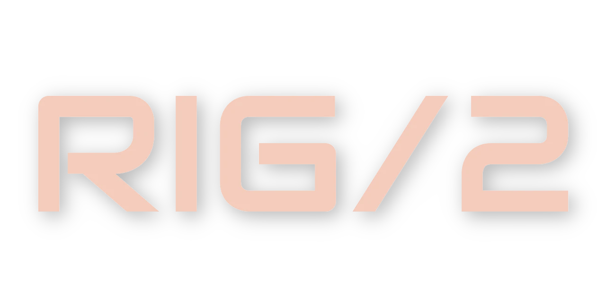

<p align="center">
  
</p>

# Rig2 Binding Tool

**Rig2 Binding Tool** is a modular rigging and binding solution for Blender, specifically designed for Rig2 Armatures. It provides a robust set of tools for management, binding, and is prepared for future Face/MoCap integration.

## Key Features

- 🛠️ **Modular Binding**: Optimized workflows for Rig2 Armature binding.
- 🌐 **Multi-language Support**: Built-in i18n support for English and Simplified Chinese.
- 🔌 **Blender 4.5+ Compatible**: Developed for latest Blender features and APIs.
- 🚀 **Performance Focused**: Efficient rigging operations directly within the Blender UI.
- 🎥 **Future Ready**: Architecture designed to support Face/MoCap modules.

## Installation

1. Download the latest release (or clone the repository).
2. Compress the project folder into a `.zip` file if downloaded manually.
3. In Blender, go to **Edit** > **Preferences** > **Add-ons**.
4. Click **Install...** and select your `.zip` file.
5. Search for "Rig2 Binding Tool" and enable it.

## Quick Start

- **Location**: Found in the **Properties Panel > Data Tab** or the **3D View Side Panel (N-Panel)**.
- **Preferences**: Customize the addon via the Blender Add-on Preferences.

## Development

This project is structured modularly:

- `src/modules/rig_controls`: Tools for rig manipulation.
- `src/modules/binding`: Core binding logic.
- `src/i18n`: Internationalization files.

### Native Backends (C++)

Commercial logic backends are now provided as CPython C++ extensions:

- `rig2_miframes`
- `rig2_face_cap`

Build and place binaries for the current Python runtime:

```bash
python3 scripts/build_native.py
```

Force legacy version-specific binaries (disable ABI3):

```bash
RIG2_ENABLE_ABI3=0 python3 scripts/build_native.py
```

Output location:

- `src/native/binaries/<platform-tag>/`

When built with `setuptools`, native modules use `abi3` (stable ABI, `Py3.9+`),
and are copied to:

- `src/native/binaries/<sys.platform>-<arch>-<pyver>/`
- `src/native/binaries/<sys.platform>-<arch>-abi3/`
- (compat) `src/native/binaries/<sys.platform>-<pyver>/`
- (compat) `src/native/binaries/<sys.platform>-abi3/`

Runtime loader search order is:

1. `<sys.platform>-<arch>-abi3`
2. `<sys.platform>-abi3`
3. `<sys.platform>-<arch>-<pyver>`
4. `<sys.platform>-<pyver>`

### Cross-Platform Artifacts

CI workflow [build-native-binaries.yml](/Users/jaxlocke/rig2_ecosystem/rig2_addons/.github/workflows/build-native-binaries.yml)
builds wheels for:

- Linux: `x86_64`, `aarch64`
- macOS: `x86_64`, `arm64`
- Windows: `AMD64`, `ARM64`

Then converts wheels to addon runtime layout using:

- [extract_native_from_wheels.py](/Users/jaxlocke/rig2_ecosystem/rig2_addons/scripts/extract_native_from_wheels.py)

### VSCode Blender Addon Link Issue

If Blender VSCode startup throws:
`FileExistsError: ... scripts/addons/rig2_addons`
it is usually caused by a broken symlink left by an old workspace path.

Fix by recreating the symlink:

```bash
rm "/Users/<you>/Library/Application Support/Blender/4.5/scripts/addons/rig2_addons"
ln -s "/absolute/path/to/rig2_addons" "/Users/<you>/Library/Application Support/Blender/4.5/scripts/addons/rig2_addons"
```

---

_Created by Antigravity_
